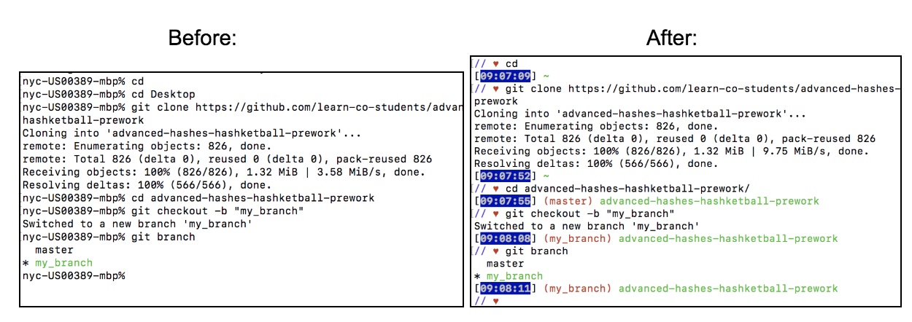

If your Terminal looks like the one on the left, we should change the settings so that it looks more like the one on the right.




There are lots of benefits to having a cleaner, more color-coded terminal. You'll be able to see which folder you are in and which branch you are working off of more clearly and lead to more productive work.

Run the following in your terminal:

`chsh -s /bin/bash`

You may have to enter your computer's password next. Otherwise, continue with:

`touch ~/.bash_profile`

`open ~/.bash_profile`

This will open up a file which may or may not already have some content in it. Either way, copy the following and paste it at the end of file:

```
function parse_git_branch {
    git branch --no-color 2> /dev/null | sed -e '/^[^*]/d' -e 's/* \(.*\)/ (\1)/'
  }
  function prompt {
    local   CHAR=""
    local   RED="\[\e[0;31m\]"
    local   BLUE="\[\e[0;34m\]"
    local   GREEN="\[\e[0;32m\]"
    local   GRAY_TEXT_BLUE_BACKGROUND="\[\e[37;44;1m\]"
    local   RESET="\[\e[0m\]"
    export PS1="\[\e]2;\u@\h\a[$GRAY_TEXT_BLUE_BACKGROUND\t$RESET]$RED\$(parse_git_branch) $GREEN\W\n$BLUE//$RED $CHAR $RESET"
      PS2='> '
      PS4='+ '
    }
  prompt
  function bp {
    $EDITOR ~/.bash_profile
  }
```

Finally, quit and open up your terminal again and you should be good to go!